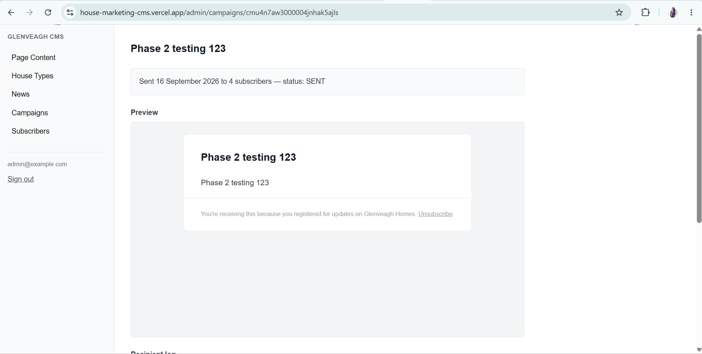
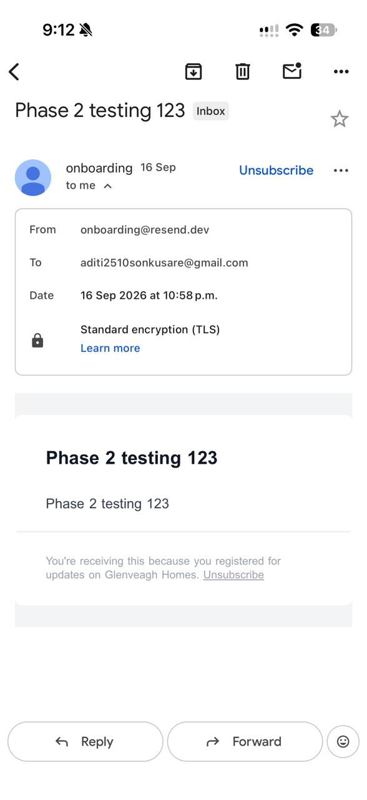
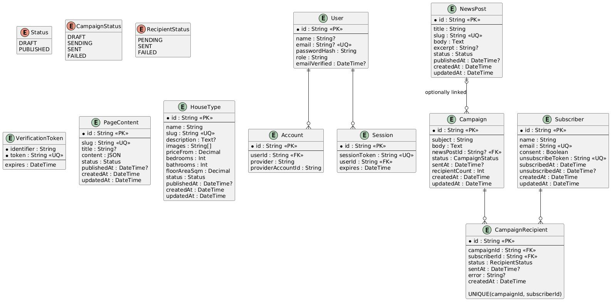

# Glenveagh Homes

A marketing site and custom CMS for a fictional housing development, built for the
Glenveagh Properties coding challenge. Everything the public site shows — house
types, news posts, page content — is served from a self-built CMS via a GraphQL API,
so editing content in the admin updates the live site with no code deploy.

## Tech stack

- **Frontend/backend:** Next.js 16 (App Router) + React 19 — one app, server-rendered
- **API:** GraphQL via Apollo Server, mounted at `/api/graphql`
- **Database:** PostgreSQL + Prisma ORM
- **Auth:** NextAuth (Credentials provider, one seeded admin user)
- **Email:** Nodemailer over SMTP (Mailpit locally; works against a real provider like Resend/Brevo by env config alone)
- **Styling:** Tailwind CSS 4
- **Local infrastructure:** Docker Compose (Postgres + Mailpit SMTP sandbox)

## Key decisions and trade-offs

- **Next.js + GraphQL:** Unified single-deploy architecture powering the public site, admin dashboard, and API. GraphQL provides a shared, type-safe schema across all routes and includes Apollo Sandbox for easy API testing.
- **PostgreSQL + Prisma:** Enforces relational integrity directly in Postgres using constraints like UNIQUE(campaignId, subscriberId). Prisma delivers end-to-end TypeScript safety and integrates seamlessly with serverless Neon in production.
- **Mailpit locally, Resend in production:** Uses Mailpit for zero-config local email testing and Resend’s HTTP API in production to bypass serverless SMTP restrictions. A single mailer abstraction automatically selects the right transport based on environment variables.
- **Image URLs instead of file uploads:** Image URLs over File Uploads Stores image references as a simple URL array (HouseType.images) to avoid extra cloud storage overhead for the initial POC. Direct file uploads and media management can easily be added as the platform matures.
- **Synchronous campaign sending:** Processes campaign emails synchronously to provide instant status feedback in the admin UI without complex queue infrastructure. As recipient lists scale, this can transition to asynchronous background processing with retries.

## Prerequisites

- [Node.js](https://nodejs.org/) 20 or later
- [Docker Desktop](https://www.docker.com/products/docker-desktop/) (for local Postgres + Mailpit), or your own Postgres instance

## Hosted demo

| | URL |
|---|---|
| Public marketing site | [house-marketing-cms.vercel.app](https://house-marketing-cms.vercel.app/) |
| Admin login | [house-marketing-cms.vercel.app/admin/login](https://house-marketing-cms.vercel.app/admin/login) |
| Source repository | [github.com/Aditisonkusare/house-marketing-cms](https://github.com/Aditisonkusare/house-marketing-cms) |

The hosted admin uses the same application and login flow as the local setup.
Credentials are intentionally not committed to this repository or hardcoded anywhere
in the codebase — a test admin login for this submission is included directly in the
submission email, so reviewing the hosted admin doesn't depend on separate LastPass
access.

### Production services

| | Provider | Notes |
|---|---|---|
| Database | [Neon](https://neon.tech/) (serverless Postgres) | Free tier, no credit card required |
| Email delivery | [Resend](https://resend.com/) | Free tier, no credit card required |
| Hosting | [Vercel](https://vercel.com/) | Free (Hobby) tier, no credit card required |

Production uses Neon's pooled connection string for `DATABASE_URL` at runtime, and
Resend's HTTP API (via `RESEND_API_KEY`) instead of raw SMTP, since serverless
platforms like Vercel commonly block or throttle outbound SMTP ports.

## AI uses

The Claude Code CLI was used during development to:

- Plan the application structure and implementation approach in plan mode.
- Consult and summarize relevant technical documentation when working with the project stack.
- Support code development and deployment workflows, including implementation guidance, debugging, and release preparation.
- Create mock seed data for the development database, including sample homes, news posts, and page content.
- Draft and refine website copy for the public marketing pages and email content.

## Getting started

**1. Clone the repo and install dependencies**

```bash
git clone https://github.com/Aditisonkusare/house-marketing-cms.git
cd house-marketing-cms
npm install
```

**2. Set up your environment file**

```bash
cp .env.example .env
```

Then edit `.env`:
- Generate a value for `NEXTAUTH_SECRET`:
  ```bash
  openssl rand -base64 32
  ```
- Set `SEED_ADMIN_EMAIL` / `SEED_ADMIN_PASSWORD` to whatever you want your local admin login to be.

**3. Start Postgres and Mailpit**

```bash
docker compose up -d
```

**4. Set up the database**

```bash
npx prisma migrate deploy
npx prisma db seed
```

This applies the schema and creates the one seeded admin user from your `.env`.

**5. Run the app**

```bash
npm run dev
```

| | |
|---|---|
| Public site | http://localhost:3000 |
| Admin login | http://localhost:3000/admin/login |
| GraphQL API (Apollo Sandbox) | http://localhost:3000/api/graphql |
| Mailpit (test inbox) | http://localhost:8025 |

Log into the admin with the `SEED_ADMIN_EMAIL` / `SEED_ADMIN_PASSWORD` you set in `.env`.

## Sending a campaign

From the admin, register a few subscribers via the public `/register` form (your own
test addresses are fine), then go to **Campaigns → New Campaign**, write a subject and
body, optionally link a published news post, and save the draft. Open the campaign to
preview exactly what will be sent, then hit **Send Campaign** — it emails every
consented subscriber via SMTP, and the same page then shows a per-recipient log
(sent/failed). Every email includes an unsubscribe link; clicking it revokes consent so
that subscriber is excluded from future sends. Check delivered emails at Mailpit
(`http://localhost:8025`) locally, or your real provider's inbox in production.

### Delivered campaign email

Sent from the hosted admin (Vercel + Resend), showing the campaign marked `SENT`:



And the same email as delivered to a real inbox:



## What I would do next

- **Background campaign processing** with retries and delivery progress.
- **Audience filters** so admins can review and refine campaign recipients before sending.
- **Server-side validation and role-based admin permissions.**
- **A media library** for uploading, previewing, and reusing images.
- **Content previews, scheduled publishing, and revision history.**

## Data model

The application uses PostgreSQL with Prisma. CMS content is separated from email
campaign data, while `CampaignRecipient` records the delivery status for each
subscriber. Public GraphQL queries only return content whose `status` is
`PUBLISHED`; drafts remain available to authenticated CMS users.

The full PlantUML source is available in [docs/data-model.puml](docs/data-model.puml).



To re-render the diagram from the PlantUML source:

```bash
plantuml docs/data-model.puml
```

This produces `docs/data-model.png` or `docs/data-model.svg`, depending on the
PlantUML output options used.

## Project structure

```
app/(site)/          Public marketing site — homepage, house types, news, register, unsubscribe
app/admin/            CMS admin — login, CRUD for page content / house types / news, campaigns, subscribers
app/api/graphql/      Apollo Server GraphQL API
lib/graphql/          GraphQL schema and resolvers
lib/validation/        Shared validation schemas
lib/campaigns/         Email template and campaign-send logic
lib/mailer.ts          Nodemailer/SMTP wrapper
docs/data-model.puml   PlantUML database model diagram (source)
docs/data-model.jpg    Rendered data model diagram (embedded in README)
prisma/schema.prisma   Database schema
docker-compose.yml     Local Postgres + Mailpit
```

## Useful commands

| Command | What it does |
|---|---|
| `npm run dev` | Start the dev server |
| `npm run build` | Production build |
| `npm run start` | Start the production server after building |
| `npm run lint` | Run ESLint |
| `npx prisma studio` | Browse the database in a GUI |
| `npx prisma migrate dev` | Create a new migration while developing |
